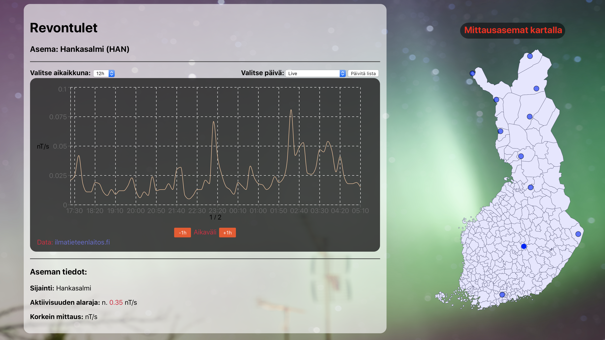
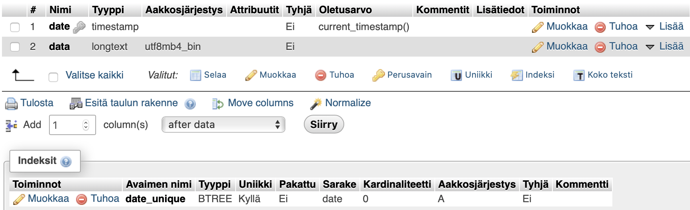
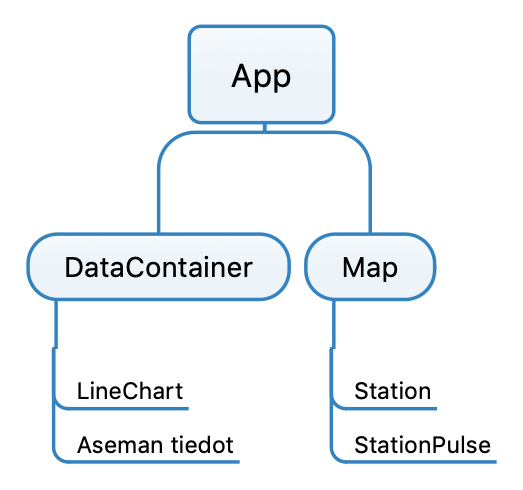
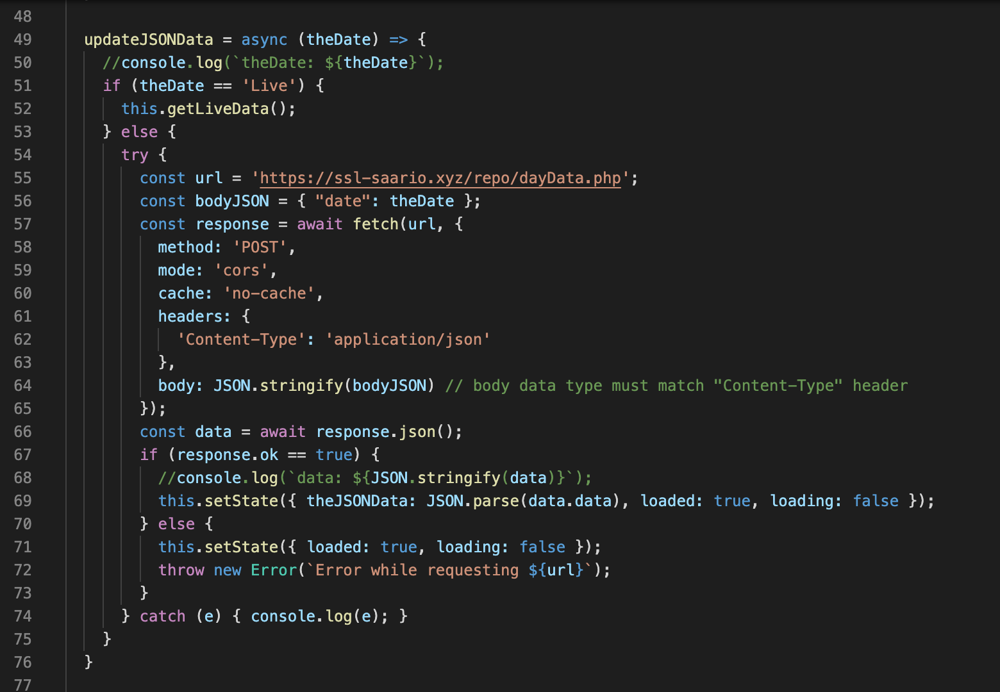
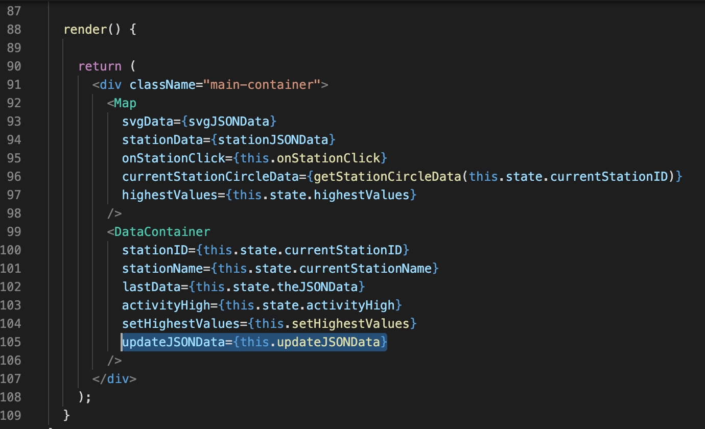
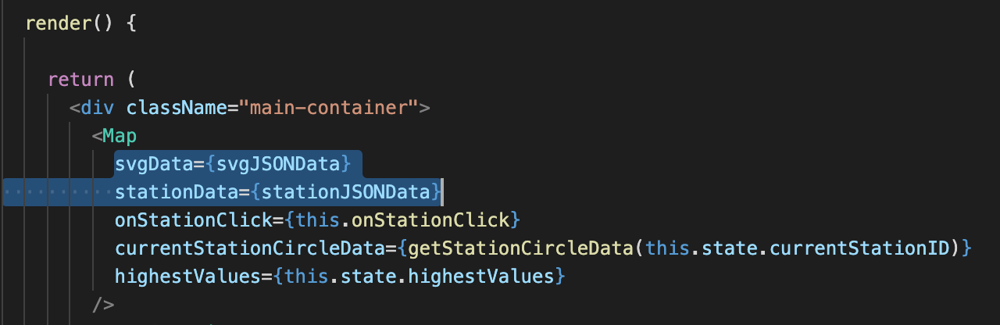
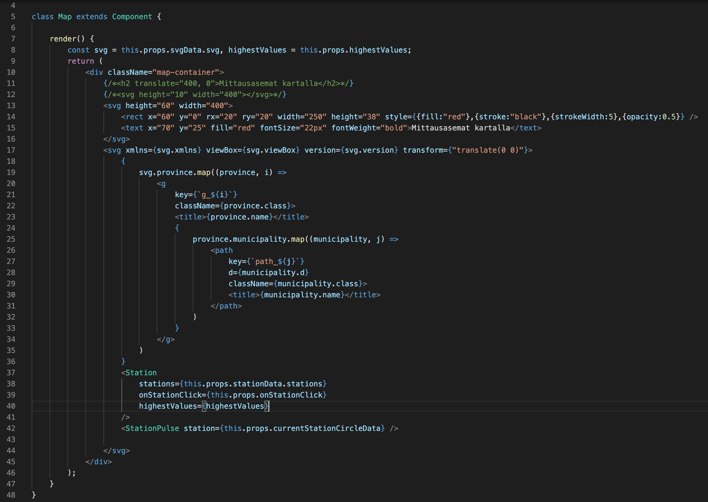

# Harjoitustyö - Revontulet

15.04.2020 
Oskari Saarinen N8243 
TTMS-0500 Web-ohjelmointi 

Toimiva sovellus löytyy täältä: https://ssl-saario.xyz/repo/app/

Kaikki lähdekoodit (myös reactin luomat) zipattuna: https://ssl-saario.xyz/repo/all.zip

Pelkät lähdekoodit löytyvät kansiosta `source/` (PHP- ja init.sql -tiedostot ovat juurikansiossa)

Videoesittely: https://youtu.be/c_83nBDgsXg

## Kuvaus
### Mitä:
Oma versioni Ilmatieteenlaitoksen avaruussää -sivusta (http://www.ilmatieteenlaitos.fi/revontulet-ja-avaruussaa),
Reactilla toteutettuna.

### Miksi:
Aloitin joskus 2018-2019 samantapaisen iOS-projektin, mutta sitten aika ja innostus loppuivat,
joten halusin nyt tehdä web-version, kun siihen kerran tilaisuus tuli.

### Toiminta:
Klikkaamalla kartalla olevaa asemaa, päivittyy aseman tiedot ja mittausdata omaan diviinsä.
Mittausdata on nT/s eli nanoteslaa per sekunti.
Mittausdata visualisoituu kaavioon, jonka aikaikkunaksi voi valita 1h, 3h, 6h, 12h tai 24h.
Kun mittausarvo ylittää asemakohtaisen alarajan, ilmestyy kaavioon revontuli-iconi.
Tällöin revontulien todennäköisyys alkaa olla kohtalainen.
Ajankohdaksi datalle voidaan valita, joko livedata tai hakea tietokannasta tietty päivä.

<strong>Kuva valmiista sivusta</strong>:

## Tietokanta
Ilmatieteenlaitoksen sivuilta löytyy vain viimeisen 24h data, joten historia -ominaisuuden luomiseksi vaaditaan tietokanta.
Tietokantana toimii web-hotelli Hostingerin MySQL-tietokanta.
### MySQL:
Tuli tehtyä useampi erilainen tietokanta, mutta, kun aika alkoi loppua, päädyin yksinkertaiseen versioon, jossa on 2 arvoa:
<strong>date</strong>, joka sisältää UNIX timestampin insertointi hetkeltä (tämä on määritelty uniikiksi) ja
<strong>data</strong>, joka sisältää 24 tunnin datan JSON-stringginä

### PHP:
<strong>PHP-tiedostoja on 4</strong>:

`updateLastData.php` - Hakee Ilmatieteenlaitoksen sivuilta livedatan ja päivittää sen json-tiedostoon
(palvelin suorittaa tämän scriptin 5 min välein)

`updateRepoAlertDayData.php` - Hakee Ilmatieteenlaitoksen sivuilta tuoreimman datan ja päivittää sen MySQL-tietokantaan
(palvelin suorittaa tämän scriptin 1h välein, mutta tallentaa datan tietokantaan vain jos tunti on päivän ensimmäinen Suomen aikaa)

`dayList.php` - Hakee MySQL-tietokannasta ne päivät, joiden data on tallennettu tietokantaan ja palauttaa ne JSON -stringginä

`dayData.php` - Hakee parametrina (POST) annetun päivän datan MySQL-tietokannasta ja palauttaa sen JSON -stringginä

## Rakenne
### Komponentit
Komponenttirakenne on seuraavan kuvan mukainen

Pääkomponentti `<App />` sisältää seuraavat alakomponentit:
#### Map:
Sisältää SVG:llä piirretyn kartan (By Care, png-karttapohjan laatinut Ningyou - Oma teokseni perustuen Ningyoun png-versioon, PD/Oma, https://fi.wikipedia.org/w/index.php?curid=436716),
sekä alakomponentteina `<Station />` -komponentit, jotka näkyvät kartalla asemina,
sekä `<StationPulse />` -komponentin, joka sisältää animaation valittuna olevan aseman kohdalle.
 
#### DataContainer:
Sisältää divin datan esittämiselle, sekä `<LineChart />` -alakomponentin, joka sisältää kaavion.
Kaavio on Recharts -kirjastolla luotu (http://recharts.org).
 

## Koodin toiminta
### Datan haku:
Data haetaa `fetch`:llä `<App />`-komponentissa, sen sisältämällä aliohjelmalla (katso alla oleva kuva)

joka on välitetty parametrina `<DataContainer />`-komponentille (katso alla oleva kuva)

### Kartan ja asemien piirto:
Kartan SVG g-koodit löytyvät JSON-muodossa tiedostosta `json2.json` ja asemien data tiedostosta `stations.json`.
Nämä tiedot välitetään parametreina komponentille `<Map />`:

Data parsitaan SVG-muotoon komponentin `<Map />` renderissä:

 
 
## Itsearvio
Ehdotan työn arvosanaksi 5. Työ on laaja ja sisältää paljon eri tekniikoita, kuten `HTML`, `JavaScript`, `CSS`, `PHP`, `MySQL`, `React`, `JSON` ja `SVG`.
Työ sisältää paljon koodia. Iso osa työhön käytetystä ajasta meni SVG-tiedostojen suunnitteluun ja/tai
parsimiseen JSON-muotoon (~20h), mutta graafiset työthän eivät ole ikinä valmiita, vaan niitä voi aina parannella.
Itse koodin kirjoittamiseen meni ~40h. Työ toimii halutulla tavalla muuten, mutta sivu ei tällä hetkellä toimi
pienellä näytöllä, varsinkaan mobiilissa kunnolla, sillä kartta jää silloin taustalle piiloon. Aika ei myöskään riittänyt
kaiken sen datan näyttämiseen, kuten asemien koordinaatit ja asemien suurimmat mittaustulokset.

## Asennus
Manuaalinen asennus vaatii, että koneellesi on asennettu `npm`.

Sivu on toimintavalmis kopioimalla `build`-kansion sisältö palvelimelle (HUOM. Sivu on rakennettu olettaen sen
sijaitsevan kansiossa `repo/app/`).

### Manuaalinen asennus:
Tee uusi `react`-sovellus komennolla `npx create-react-app app-name`

Kopioi kansion `source` sisältö edellä luomasi sovelluksen kansioon `app-name/src`

Asenna `Recharts` komennolla `npm install recharts`

Käynnistä kehityspalvelin siirtymällä kansioon `cd app-name` ajamalla komento `npm start`
tai luo julkaisuvalmis versio komennolla `npm run build`

### Tietokannan asennus
Myös kotisivuillani olevaa valmista tietokantaa voi käyttää, mikäli se on yhä käytössä, kun tätä luet.

Tietokannan luonti tiedosto on `init.sql`

Luotuasi tietokannan, muista päivittää `PHP`-tiedostoihin oikeat kirjautumistiedot ja tietokannan nimi.

Muista myös päivittää `JavaScript`-koodiin uudet osoitteet.

